# Active Directory in Azure

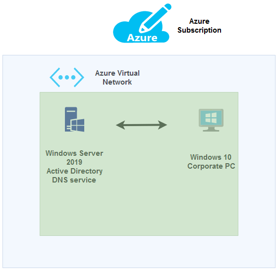

- This lab pretent to be a simulation of corporate enviroment, objetive is a Windows 10 machine can login into Active Directory hosted in WS machine.

##

# 1. Deploy and configuration of Windows Server

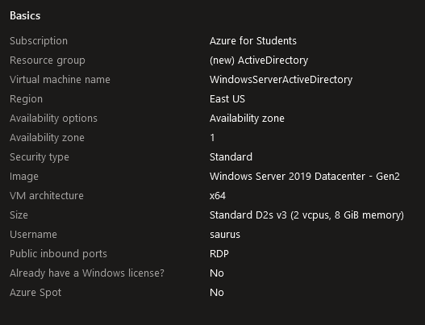

 - This is the settings to Windows Server machine.
##

 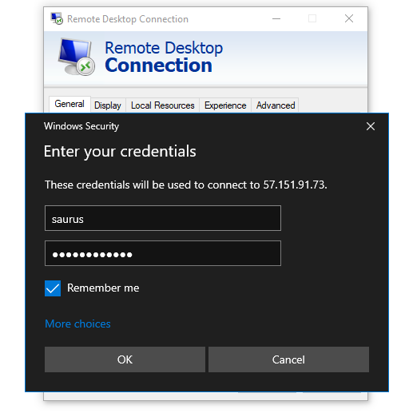 

- Login in RDP with the credentials

##

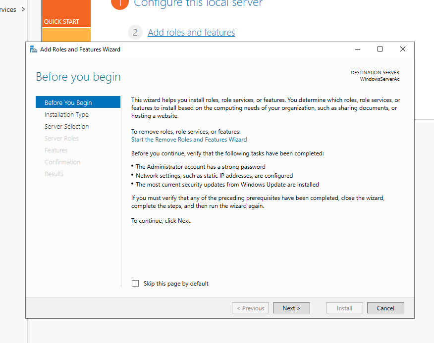
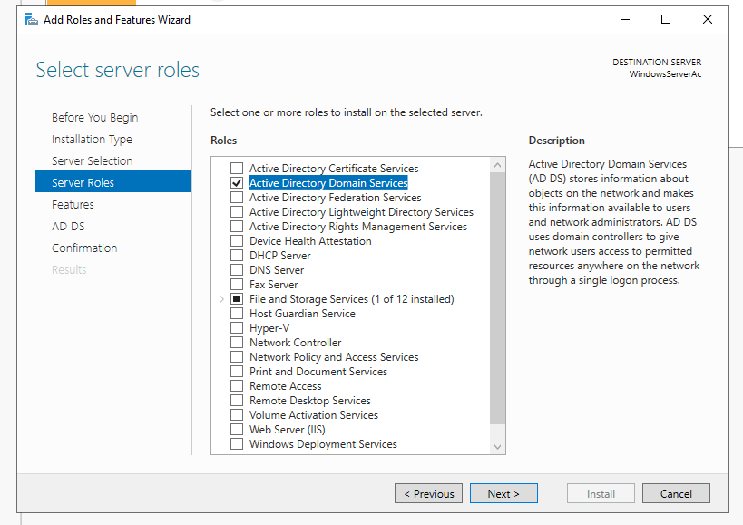

- In Windows Server machine, we install Active Directory

##

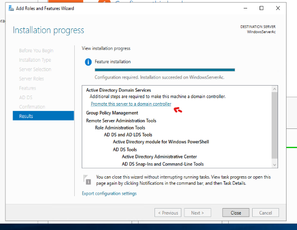
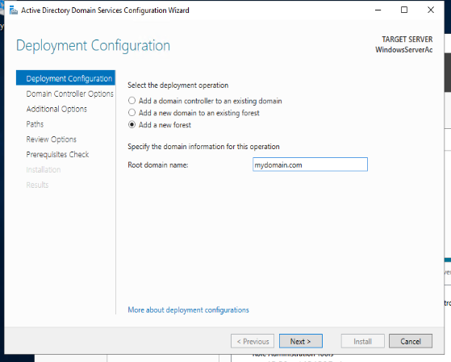
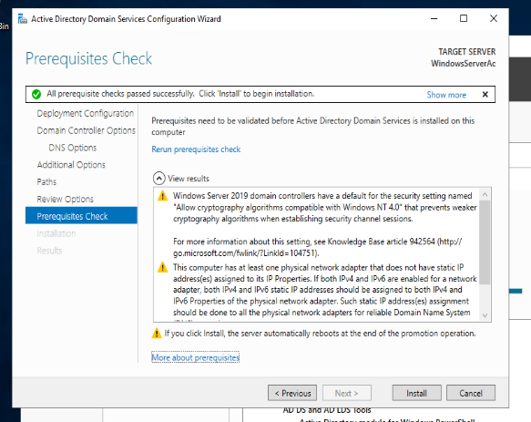

- This is a internal domain.

##

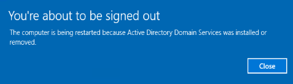

- After installation, automatically the VM gonna restart

##

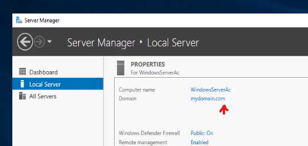

- Internal domain.

##

# 2. Automated user creation with PowerShell

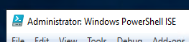

- To create ours users, we gonna use a PowerShell script.

            Set-ExecutionPolicy Unrestricted

            

##

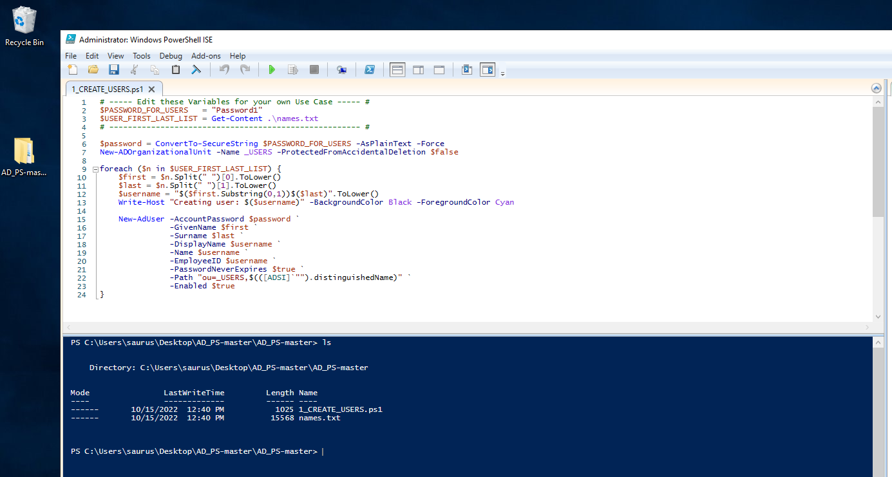

- If you want to download the scrip and list, is in the repository
- To scrip works, you need to use cd to the correct path

##

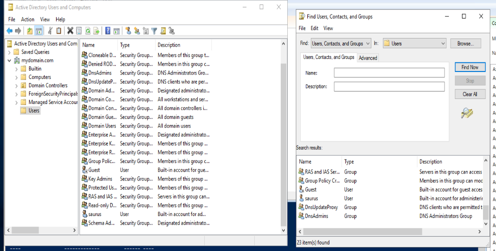
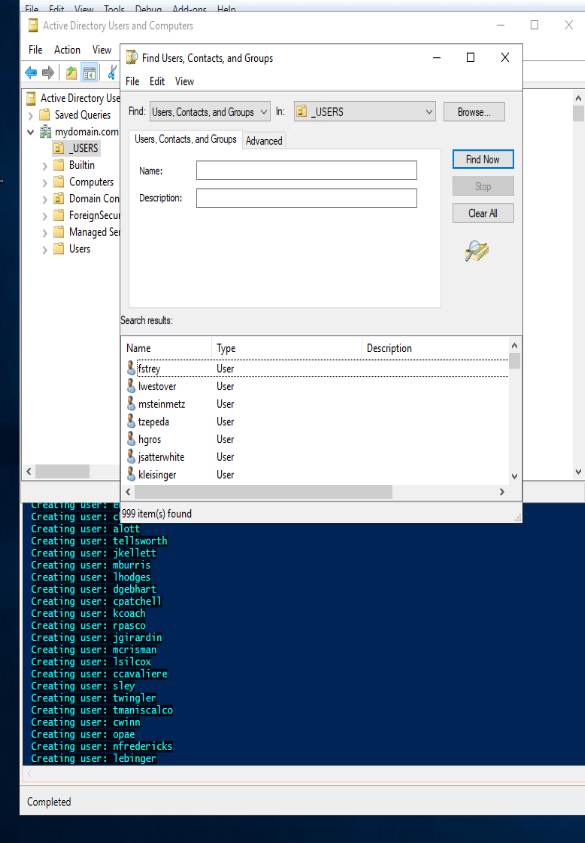

- Now, we have a AD with 999 users.
#

# 3. DNS server

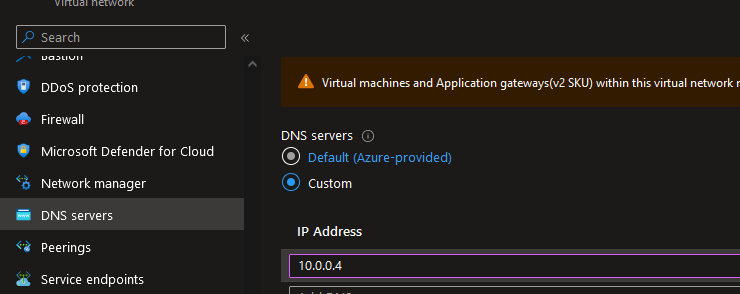

- That IP is from the Windows Server VM.
